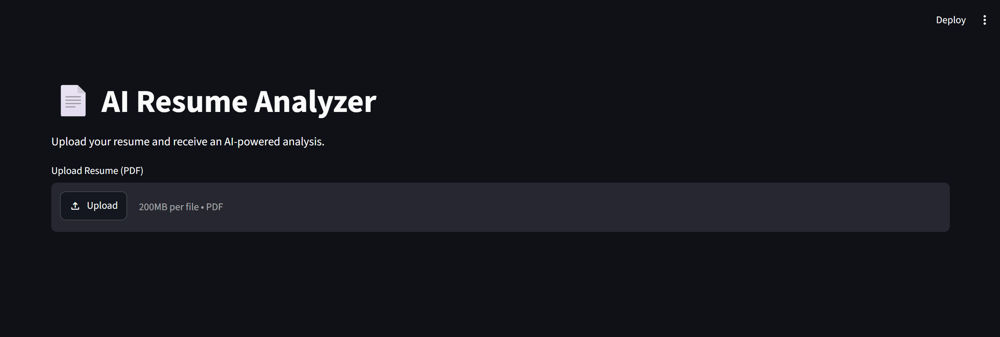
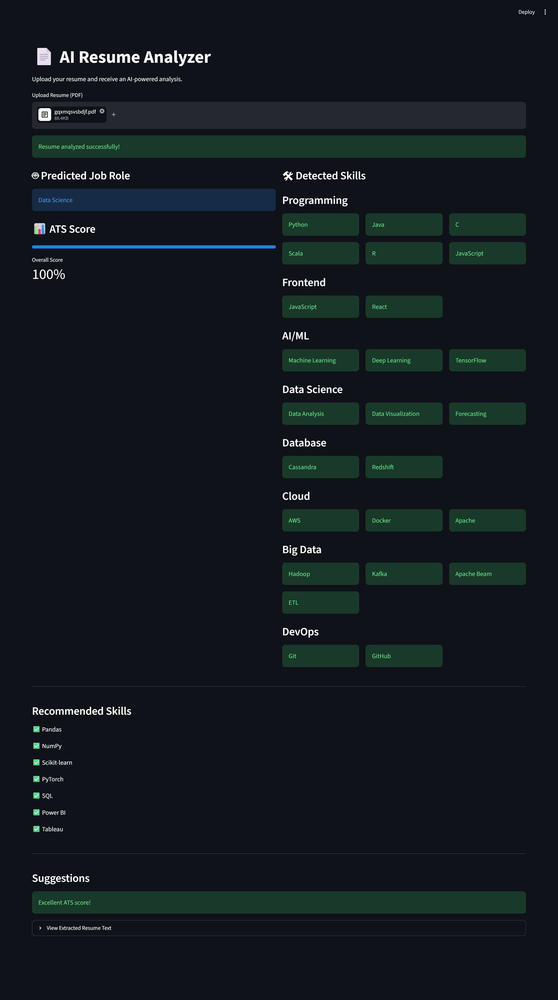

# 📄 AI Resume Analyzer

An AI-powered Resume Analyzer built using **Python, NLP, Machine Learning, and Streamlit**. The application analyzes PDF resumes, predicts the most suitable job role, evaluates ATS compatibility, extracts technical skills, and recommends missing skills to improve employability.

---

## 🚀 Features

- 📄 Upload resumes in PDF format
- 🤖 Predict job role using Machine Learning
- 📊 Calculate ATS (Applicant Tracking System) score
- 🧠 Extract technical skills using NLP
- 💡 Recommend missing skills based on the predicted role
- 📑 View extracted resume text
- 🎨 Interactive Streamlit web interface

---

## 🛠️ Tech Stack

| Category | Technologies |
|----------|--------------|
| Language | Python |
| Machine Learning | Scikit-learn |
| NLP | TF-IDF, NLTK, Regular Expressions |
| Data Processing | Pandas, NumPy |
| Model | Logistic Regression |
| PDF Processing | pdfplumber |
| Frontend | Streamlit |
| Model Serialization | Joblib |

---

## 📂 Project Structure

```
AI-Resume-Analyzer/
│
├── app.py
├── requirements.txt
├── README.md
│
├── data/
│   ├── UpdatedResumeDataSet.csv
│   ├── skills.csv
│   └── role_skills.csv
│
├── images/
│
├── models/
│   ├── classifier.pkl
│   └── tfidf.pkl
│
├── notebooks/
│   └── Resume_Classifier_Training.ipynb
│
├── src/
│   ├── ats.py
│   ├── pdf_reader.py
│   ├── predictor.py
│   ├── preprocessing.py
│   ├── recommendations.py
│   └── skill_extractor.py
│
├── test_predictor.py
├── test_ats.py
└── test_recommendations.py
```

---

# 📖 Workflow

```text
PDF Resume
     │
     ▼
Extract Text
     │
     ▼
Text Preprocessing
     │
     ▼
TF-IDF Vectorization
     │
     ▼
Logistic Regression Classifier
     │
     ▼
Predicted Job Role
     │
     ├──────────────► ATS Score
     │
     ├──────────────► Skill Extraction
     │
     └──────────────► Skill Recommendations
```

---

# 🧠 Machine Learning Pipeline

### Data Preprocessing

- Lowercase conversion
- URL removal
- Special character removal
- Stopword removal
- Whitespace normalization

### Feature Extraction

- TF-IDF Vectorization
- Maximum Features: **5000**

### Model

- Logistic Regression Classifier

### Evaluation

- Accuracy: **99.48%**

---

# 📊 ATS Evaluation

The ATS engine evaluates resumes using rule-based checks including:

- ✅ Email Address
- ✅ Phone Number
- ✅ Skills Section
- ✅ Education
- ✅ Experience
- ✅ Projects
- ✅ Resume Length

---

# 💼 Skill Recommendation Engine

The application compares extracted skills with role-specific skills and recommends missing technologies.

Example:

```
Predicted Role:
Data Science

Detected Skills:
✔ Python
✔ TensorFlow
✔ Docker

Recommended Skills:
✔ Pandas
✔ NumPy
✔ Scikit-learn
✔ PyTorch
✔ Tableau
✔ Power BI
```

---

# 📸 Screenshots

## Home Page

```

```

---

## Resume Analysis

```

```

---

# ⚙️ Installation

Clone the repository

```bash
git clone https://github.com/MoonRaker07/AI-Resume-Analyzer.git
```

Move into the project

```bash
cd AI-Resume-Analyzer
```

Create virtual environment

```bash
python -m venv .venv
```

Activate virtual environment

### Windows

```bash
.venv\Scripts\activate
```

### Linux / macOS

```bash
source .venv/bin/activate
```

Install dependencies

```bash
pip install -r requirements.txt
```

Run the application

```bash
streamlit run app.py
```

---

# 🎯 Future Improvements

- Resume-to-job description matching
- Resume ranking
- AI-powered resume feedback using LLMs
- OCR support for scanned resumes
- Resume keyword highlighting
- Deploy on Streamlit Cloud

---

# 👨‍💻 Author

**Dhairya Sharma**

B.Tech in Artificial Intelligence & Machine Learning
Kurukshetra University

GitHub: https://github.com/MoonRaker07

LinkedIn: https://www.linkedin.com/in/dhairya-sharma-0509b1272

---

# ⭐ If you found this project useful, consider giving it a star!